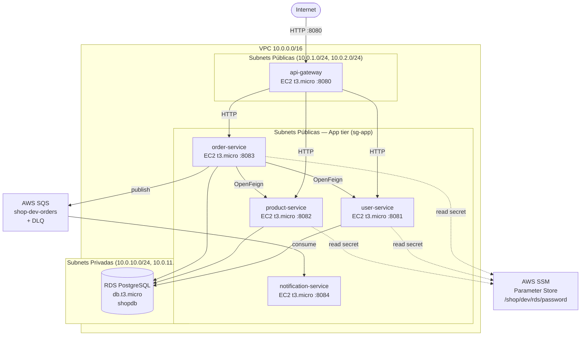
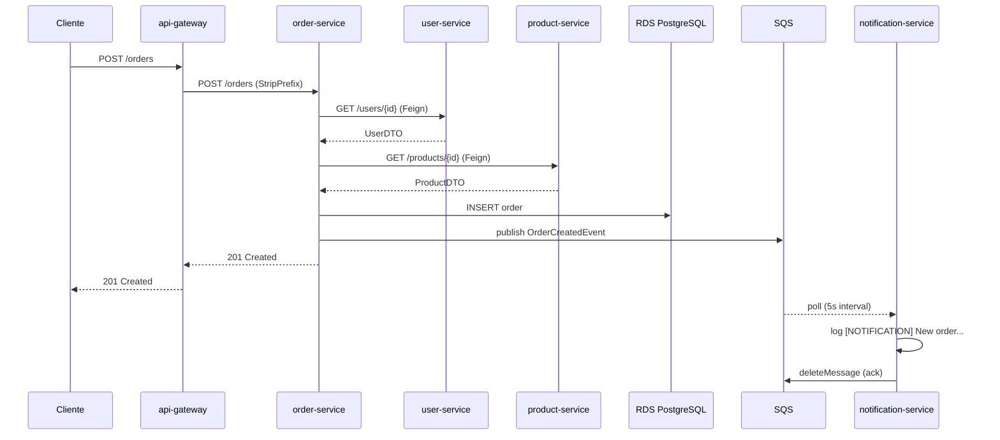

# Arquitetura do Sistema

## Visão Geral

Sistema de e-commerce baseado em microserviços deployado em AWS (eu-central-1).
Usa a aplicação de laboratório como base (Approach A) e estende-a com infraestrutura
cloud-native: VPC customizada, EC2, RDS PostgreSQL, SQS para comunicação assíncrona,
Terraform para IaC e GitHub Actions para CI/CD.

## Diagrama de Arquitectura



## Fluxo de Criação de Encomenda



## Serviços

| Serviço              | Porta | Responsabilidade                          | Base de dados |
|----------------------|-------|-------------------------------------------|---------------|
| api-gateway          | 8080  | Routing, ponto de entrada público         | —             |
| user-service         | 8081  | Gestão de utilizadores                    | PostgreSQL     |
| product-service      | 8082  | Catálogo de produtos, stock               | PostgreSQL     |
| order-service        | 8083  | Criação de encomendas, publica em SQS     | PostgreSQL     |
| notification-service | 8084  | Consome SQS, regista notificações         | —             |

## Comunicação

- **Síncrona (HTTP/Feign):** api-gateway → user/product/order-service; order-service → user/product-service
- **Assíncrona (SQS):** order-service publica `OrderCreatedEvent` → fila `shop-dev-orders` → notification-service consome com `@Scheduled(fixedDelay=5000)`
- **Retry/DLQ:** mensagens que falham 3 vezes são movidas para `shop-dev-orders-dlq`

## Infraestrutura AWS

| Recurso         | Configuração                                          |
|-----------------|-------------------------------------------------------|
| VPC             | CIDR 10.0.0.0/16, DNS hostnames activos               |
| Subnets públicas| 10.0.1.0/24 (AZ-a), 10.0.2.0/24 (AZ-b)              |
| Subnets privadas| 10.0.10.0/24 (AZ-a), 10.0.11.0/24 (AZ-b)            |
| EC2             | t3.micro por serviço, Amazon Linux 2023               |
| RDS             | db.t3.micro, PostgreSQL 16, subnet privada            |
| SQS             | Standard queue + DLQ, maxReceiveCount=3               |
| SSM             | Parameter Store para secrets, AmazonSSMManagedInstanceCore nos EC2s |

## Módulos Terraform

```
modules/
├── vpc/        VPC, subnets, IGW, route tables, security groups
├── compute/    EC2 + IAM role SSM + instance profile
├── database/   RDS PostgreSQL + subnet group
└── queue/      SQS + DLQ + resource policy
```